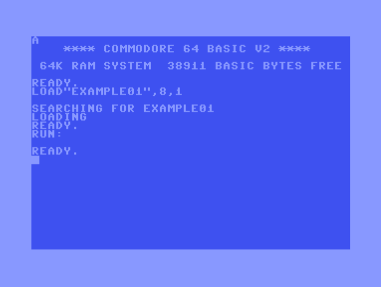

# Running a built program from the command line

Before running a compiled sharkC64 program, check that you have installed
VICE emulator, see instructions for the [setup](../prerequisites/setup.md).
If you have not compiled the sharkC64 program, see instructions for [compiling](cli-compiling.md).

Steps to run a compiled sharkC64 program:
1. Open command prompt or a terminal window on your computer.
2. Move to the folder where you have installed the sharkC64 IDE;
   for instance,
   ```
   cd C:\SHARKC64
   ```
3. Check where you have installed VICE emulator.
   In this example, we assume that it has been installed to
   ```
   C:\APP\GTK3VICE-3.7-win64
   ```
4. Check that the compiled sharkC64 program is in the folder structure:
   ```
   C:\SHARKC64
   |
   +-- sharkC64-x.y.z
   |   |
   |   +-- bin
   |   |   |
   |   |   +-- examples            // examples folder created by sharkC64
   |   |   |   |
   |   |   |   ...
   |   |   |
   |   |   +-- prg                 // folder for built programs created by sharkC64
   |   |   |   |
   |   |   |   +--example01.prg
   |   |   |   ...
   |   |   |
   |   |   +--sharkC64             // starter script for MacOS
   |   |   +--sharkC64.bat         // starter script for Windows
   |   |   +--sharkC64.ini         // settings for the sharkC64
   |   |
   |   +-- lib
   |   |   |
   |   |   ...
   ```
5. Run the compiled file `example01.prg` by typing the following command
   ```
   C:\App\GTK3VICE-3.7-win64\bin\x64sc sharkC64-0.3\bin\prg\example01.prg
   ```
   It should open VICE emulator, load the program, and run it.
6. Verify that the program `example01.prg` ran correctly.
   It should display a letter 'A' on the left upper corner of the screen:

   


<br /><br />
:leftwards_arrow_with_hook: [Back to index](../index.md)

